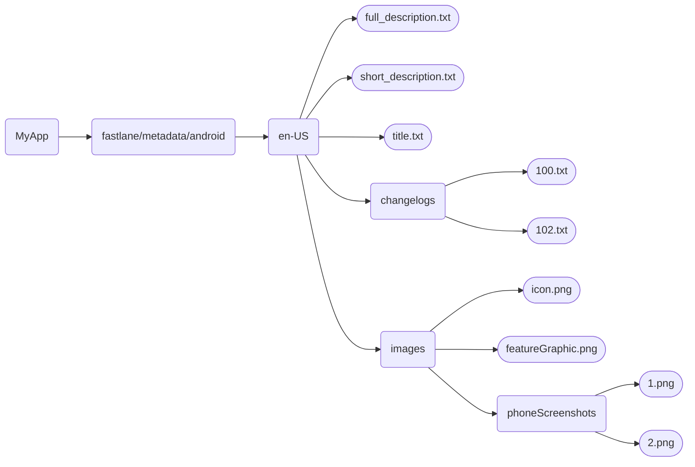
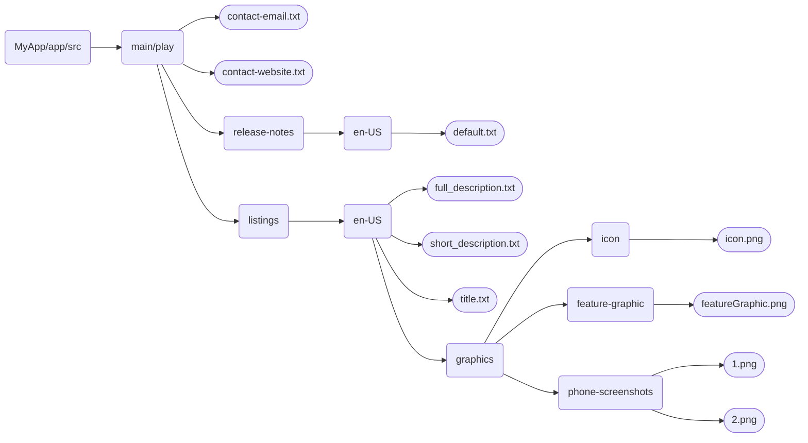

# 1. App Metadata
The app's metadata should follow the `Fastlane` or `Triple-T` structure. I recommend using the `Fastlane` structure.

You can read more about the app metadata [here](https://f-droid.org/docs/All_About_Descriptions_Graphics_and_Screenshots/).


## Fastlane
- Create any **one** of the following directories in the root of your app directory >
  - `fastlane/metadata/android`: For the rest of this guide I'll assume you created this directory
    ```mermaid
    flowchart LR
      A(MyApp) --> B(fastlane/metadata/android)
    ```
  - `metadata`
    ```mermaid
    flowchart LR
      A(MyApp) --> B(metadata)
    ```
  - `metadata/<packageName>`
    ```mermaid
    flowchart LR
      A(MyApp) --> B(metadata/com.myapp)
    ```
  - `src/<buildFlavor>/fastlane/metadata/android`: Create this if you need different descriptions for different flavors.
    ```mermaid
    flowchart LR
      A(MyApp) --> B(src/release/fastlane/metadata/android)
    ```
  
- Within the directory created above, create `en-US` directory. This is required because English is the fallback language by F-Droid. Other languages are **optional**.
  <br>For other languages create respective directories like `de-DE`, `es-ES`, `fr-FR` etc.
  ```mermaid
    flowchart LR
      A(MyApp) --> B(fastlane/metadata/android)
      B --> C(en-US)
      B --> D(de-DE)
      B --> E(es-ES)
    ```
- Within `en-US`, create >
    - `full_description.txt`: The full app description (max 4000 characters, basic HTML allowed).
    - `short_description.txt`: A brief description (max 80 characters, plain text).
    - `title.txt`: The app name.
    - `changelogs` directory: Include changelogs named as `<versionCode>.txt` (max 500 characters, plain text).
        <br>Example: If `versionCode` is `100`, create `100.txt`
    - `images` directory: Within this, create >
        - `icon.png`: The app icon (min 48x48 px, max 512x512 px).
        - `featureGraphic.png`: Banner displayed on top (landscape, either 512x250 px or 1024x500 px).
        - `phoneScreenshots` directory: Include screenshots named as `1.png`, `2.png`, etc. (PNGs or JPGs only).

The final fastlane structure should look like the following:
     


For reference, check [this fastlane structure](https://github.com/StellarSand/IYPS/tree/main/fastlane/metadata/android).


## Triple-T
- Create any **one** of the following directories within the `src` directory of your app module (in most cases the app module is the directory named `app`) >
  - `main/play`
    ```mermaid
    flowchart LR
      A(MyApp/app/src) --> B(main/play)
    ```
  - `<buildFlavor>/play`: Create this for build flavor support.
    ```mermaid
    flowchart LR
      A(MyApp/app/src) --> B(release/play)
    ```
- Within the  `play` directory, create >
  - `contact-email.txt`: Developer/Author email
  - `contact-website.txt`: Developer/Author website
  - `release-notes` directory: Within this, create >
    - `en-US` directory: Within this create >
      - `default.txt`: Latest changelog
  - `listings` directory
  ```mermaid
    flowchart LR
      A(MyApp/app/src) --> B(main/play)
      B --> C([contact-email.txt])
      B --> D([contact-website.txt])
      B --> E(release-notes)
      B --> F(listings)
      E --> G(en-US)
      G --> H([default.txt])
    ```
- Within the `listings` directory, create `en-US` directory. This is required because English is the fallback language by F-Droid. Other languages are **optional**.
  <br>For other languages create respective directories like `de-DE`, `es-ES`, `fr-FR` etc.
  ```mermaid
    flowchart LR
      A(MyApp/app/src) --> B(main/play)
      B --> C(listings)
      C --> D(en-US)
      C --> E(de-DE)
      C --> F(es-ES)
    ```
- Within `en-US` directory, create >
  - `full_description.txt`: The full app description (max 4000 characters, basic HTML allowed).
  - `short_description.txt`: A brief description (max 80 characters, plain text).
  - `title.txt`: The app name.
  - `graphics` directory: Within this, create >
    - `icon` directory: Include app icon (min 48x48 px, max 512x512 px. PNG or JPG only).
    - `feature-graphic` directory: Include banner image displayed on top (landscape, either 512x250 px or 1024x500 px. PNG or JPG only).
    - `phone-screenshots` directory: Include screenshots named as `1.png`, `2.png`, etc. (PNGs or JPGs only).

The final Triple-T structure should look like the following:


[](https://github.com/StellarSand/F-Droid-Submit-Guide/blob/main/Release-Signed-Build.md)