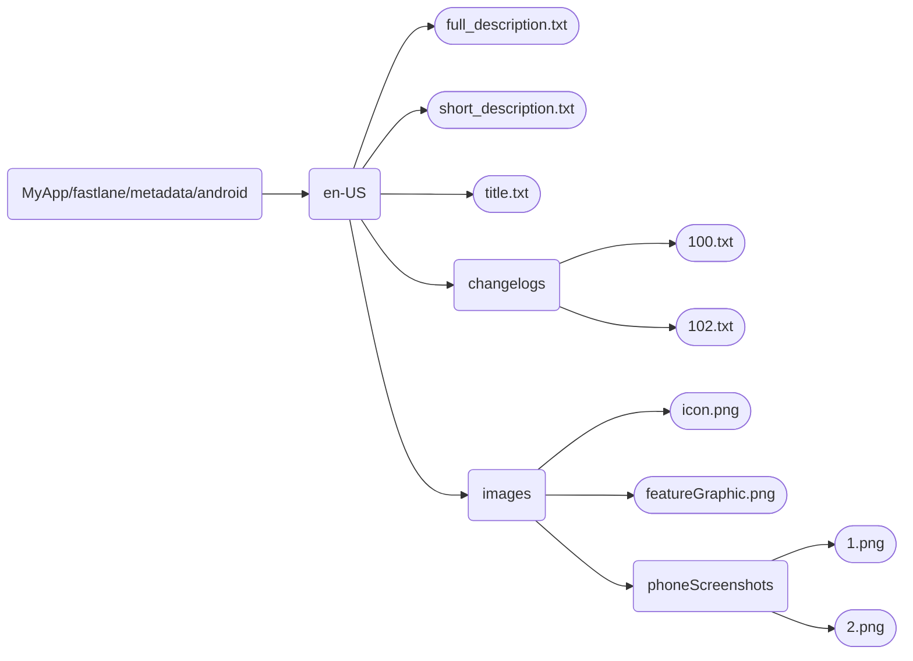

# F-Droid-Submit-Guide


## Contents
- [1. App metadata](#1-app-metadata)
- [2. Release a signed build of your app](#2-release-a-signed-build-of-your-app)
- [3. Build metadata](#3-build-metadata)
  - [Reproducible builds](#reproducible-builds)
  - [Non-reproducible builds](#non-reproducible-builds)
- [4. Request for packaging](#4-request-for-packaging)
- [5. Merge request](#5-merge-request)
- [Contributing](#contributing)
- [License](#license)


## 1. App Metadata
The app's metadata should follow the `Fastlane` or `Triple-T structure`. I recommend using the `Fastlane` structure.

- Create `fastlane/metadata/android` directory in the root of your app directory.
   Example: `MyApp/fastlane/metadata/android`
- Within `fastlane/metadata/android` create `en-US` directory. This is required because English is the fallback language by F-Droid. Other languages are optional.
  <br>For other languages create respective directories like `de-DE`, `es-ES`, `fr-FR` etc.
- Within `en-US`, create >
    - `full_description.txt`: The full app description.
    - `short_description.txt`: A brief description (max 80 characters).
    - `title.txt`: The app name.
    - `changelogs` directory: Include changelogs named as `<versionCode>.txt` (max 500 characters).
        <br>Example: If `versionCode` is `100`, create `100.txt`
    - `images` directory: Within this, create >
        - `icon.png`: The app icon.
        - `featureGraphic.png`: Banner displayed on top (landscape).
        - `phoneScreenshots` directory: Include screenshots named as `1.png`, `2.png`, etc.

The directory structure should look like the following:
     


For reference, check [this fastlane structure](https://github.com/StellarSand/IYPS/tree/main/fastlane/metadata/android).

You can read more about the app metadata [here](https://f-droid.org/docs/All_About_Descriptions_Graphics_and_Screenshots/).


## 2. Release a signed build of your app
- In Android Studio > Build > Generate signed APK
- Create a tagged release (let's say on GitHub) with the generated signed apk.


## 3. Build Metadata
- Create an account on [GitLab](https://about.gitlab.com).
- Fork the [fdroiddata](https://gitlab.com/fdroid/fdroiddata) repo.
- Create a new branch named after your app’s name or its package name.
- In the newly created branch, go to the `metadata` directory & create a new file named `<your app's package name>.yml`. Example: `com.myapp.yml`

You can read more about the build metadata [here](https://f-droid.org/en/docs/Build_Metadata_Reference/).

Before proceeding further, decide whether you want reproducible builds or not.
<br>A benefit of reproducible builds is that users can upgrade to a new version of your app irrespective of where they previously installed it from. Example: Users can install the apk from GitHub and upgrade later to a newer version using F-Droid & vice-versa.

#### Reproducible builds
- Assuming that when creating a tagged release earlier, the tag was named with a `v` (example: `v1.0.0`) and the apk was named `MyApp_v1.0.0`.
- In the root directory of your app, open the `local.properties` file.
- Copy the `sdk.dir` value. Example: `/home/JohnDoe/Android-SDK`.
- Go to `/home/JohnDoe/Android-Sdk/build-tools/` & check the latest `build-tools` version installed. Example: `34.0.0`.
- Open a terminal.
- Navigate to the directory:
  ```bash
    cd /home/JohnDoe/Android-Sdk/build-tools/34.0.0
  ```
- Use `apksigner` to get the SHA-256 digest of your signing certificate:
  ```bash
    ./apksigner verify --print-certs /path/to/the/generated_signed_apk
  ```
  Example:
  ```bash
  ./apksigner verify --print-certs /home/JohnDoe/AndroidStudioProjects/MyApp/app/release/MyApp_v1.0.0-release.apk
  ```
- Copy the `Signer #1 certificate SHA-256 digest` value.
- Type the metadata in the build metadata file created earlier (`com.myapp.yml`).
  <br>Here's an example for reproducible builds:
  ```yml
  Categories:
    - Connectivity
  License: GPL-3.0-only
  AuthorName: John Doe
  SourceCode: https://github.com/JohnDoe/MyApp
  IssueTracker: https://github.com/JohnDoe/MyApp/issues
  Translation: https://github.com/JohnDoe/MyApp/blob/main/CONTRIBUTING.md
  Changelog: https://github.com/JohnDoe/MyApp/releases
  
  AutoName: App name
  
  RepoType: git
  Repo: https://github.com/JohnDoe/MyApp.git
  Binaries: https://github.com/JohnDoe/MyApp/releases/download/v%v/MyApp_v%v.apk
  
  Builds:
    - versionName: 1.0.0
      versionCode: 100
      commit: commit number like 0bd29264d182cf456cf80d490abf285dfcb12f92
      subdir: app
      gradle:
        - yes
  
  AllowedAPKSigningKeys: SHA-256 digest of your signing certificate
  
  AutoUpdateMode: Version
  UpdateCheckMode: Tags
  CurrentVersion: 1.0.0
  CurrentVersionCode: 100
  ```
- Commit the changes

#### Non-reproducible builds
- Assuming that when creating a tagged release earlier, the tag was named with a `v` (example: `v1.0.0`) and the apk was named `MyApp_v1.0.0`.
- Type the metadata in the build metadata file created earlier (`com.myapp.yml`).
  <br>Here's an example for non-reproducible builds:
  ```yml
  Categories:
    - Connectivity
  License: GPL-3.0-only
  AuthorName: John Doe
  SourceCode: https://github.com/JohnDoe/MyApp
  IssueTracker: https://github.com/JohnDoe/MyApp/issues
  Translation: https://github.com/JohnDoe/MyApp/blob/main/CONTRIBUTING.md
  Changelog: https://github.com/JohnDoe/MyApp/releases
  
  AutoName: App name
  
  RepoType: git
  Repo: https://github.com/JohnDoe/MyApp.git
  
  Builds:
    - versionName: 1.0.0
      versionCode: 100
      commit: commit number like 0bd29264d182cf456cf80d490abf285dfcb12f92
      subdir: app
      sudo:
        - apt-get update
        - apt-get install -y openjdk-17-jdk-headless
        - update-java-alternatives -a
      gradle:
        - yes
  
  AutoUpdateMode: Version
  UpdateCheckMode: Tags
  CurrentVersion: 1.0.0
  CurrentVersionCode: 100
  ```
- Commit the changes.


## 4. Request for packaging
- Open a new issue [here](https://gitlab.com/fdroid/rfp/-/issues).
- Select the `Submission` template and remove unnecessary information.

For reference, check [this request for packaging](https://gitlab.com/fdroid/rfp/-/issues/2757).


## 5. Merge request
- Once the pipeline succeeds, go to the main [fdroiddata repo](https://gitlab.com/fdroid/fdroiddata).
- Go to Merge Requests > Open new request >
  - Source branch: your created branch
  - Target branch: master
  - Select template as `App inclusion`.

For reference, check this [merge request](https://gitlab.com/fdroid/fdroiddata/-/merge_requests/15068)

The F-Droid maintainers are super helpful as long as you're being respectful.


## Contributing
New pull requests can be submitted [here](https://github.com/StellarSand/F-Droid-Submit-Guide/pulls).


## License
This project is licensed under the terms of [MIT license](https://github.com/StellarSand/F-Droid-Submit-Guide/blob/main/LICENSE).
